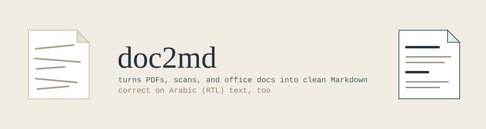

<p align="center">
  
</p>

<p align="center">
  
  
  
  
</p>

Convert any office document (PDF, DOCX, PPTX, XLSX, ODT, ODS, ODP, RTF, CSV) into clean Markdown — built specifically so the output can be fed to an AI model with far fewer tokens and much better comprehension than handing it the raw file (or a scanned image).

## Contents

- [Why this exists](#why-this-exists)
- [How it works](#how-it-works)
- [Repository layout](#repository-layout)
- [Requirements](#requirements)
- [Installation — Linux](#installation--linux-kde-plasma--dolphin)
- [Installation — Windows](#installation--windows)
- [Direct usage](#direct-usage-any-os-with-python--no-right-click-integration-needed)
- [Using it as a Claude Agent Skill](#using-it-as-a-claude-agent-skill)
- [Setting the API key manually](#setting-the-firecrawl-api-key-manually)
- [Troubleshooting](#troubleshooting)
- [License](#license)

## Why this exists

Feeding an AI a raw PDF — especially a scanned one — is expensive (images cost far more tokens than text) and often produces worse results than giving it clean, structured Markdown. This tool converts documents to Markdown first, using deterministic command-line tools rather than a model, so the conversion itself costs zero AI tokens.

It's built on [`anydoc`](https://github.com/firecrawl/anydoc) (Firecrawl), but does **not** hand PDFs to `anydoc` as a whole file. Two real bugs were found and fixed by processing PDFs page-by-page instead:

1. **Arabic/RTL text gets reversed.** `anydoc`'s native PDF text extraction reverses right-to-left glyph order character-by-character on any page with a real text layer — `"اختبار اللغة"` comes out as `"ةغللا رابتخا"`. This happens even when the document is also routed through hosted OCR — the bug hits the text-layer pages regardless of the OCR flag. Confirmed by direct testing. **Fix:** any page with a real text layer is extracted with `pdftotext` instead, which preserves correct order for both Arabic and English.
2. **Large scanned PDFs can fail OCR entirely.** Sending a big multi-page scanned PDF to hosted OCR in a single request can fail with `Firecrawl Parse: status code 499` (the connection is cut before OCR finishes). Confirmed on a real 10-page / 8 MB scanned file — the same file's first page alone OCR'd successfully. **Fix:** each scanned page is extracted and sent to hosted OCR individually, then the results are spliced back together in the correct page order.

A known limitation: a single PDF that mixes real-text Arabic pages with scanned image pages in the *same* file isn't fully solved yet — the current logic pulls the real-text pages correctly via `pdftotext` but doesn't yet re-inject OCR results for the scanned pages of that same file inline with them in all cases. This is on the list to improve.

## How it works

**Non-PDF files** (DOCX, PPTX, XLSX, ODT, ODS, ODP, RTF, CSV) are simple: the whole file goes to `anydoc` and the Markdown it returns is written out as-is.

**PDFs** are handled one page at a time, so a page's own content — not the whole document — decides how it's processed:

```
                     each PDF page
                          │
                          ▼
                pdftotext -layout <page>
                          │
                 ┌────────┴────────┐
                 │  did it return   │
                 │   real text?    │
                 └────────┬────────┘
             yes ─────────┼───────── no (scanned image)
              │           │             │
              ▼           │             ▼
      keep pdftotext's    │     pull out just this one page,
      output as-is        │     send it alone to
      (correct reading    │     `anydoc --ocr hosted`
       order, any          │             │
       language)           │             │
              │            │             │
              └─────┬──────┴──────┬──────┘
                     ▼             ▼
              add this page's text to the output,
                   in its original page position
```

Once every page has been resolved this way, the pieces are joined back together in page order into a single `.md` file. A desktop notification then reports whether the file converted fully locally, needed cloud OCR for some pages, or partially failed.

## Repository layout

```
doc2md/
├── smart_doc2md.py    # Core conversion logic — cross-platform (Linux/macOS/Windows)
├── linux/             # Right-click integration for Dolphin (KDE Plasma)
│   ├── install.sh      #   Installer: checks deps, installs the script, registers the menu entry
│   └── doc2md.desktop  #   KDE service menu definition (template — install.sh fills in your home path)
├── windows/            # Right-click integration for Windows Explorer
│   └── install.ps1      #   Installer: checks deps, installs the script, registers a context-menu entry
│                         #   NOT yet verified on a real Windows machine — see "Windows" section below
├── skill/              # A Claude Agent Skill wrapping this tool
│   ├── SKILL.md          #   Tells a Claude agent (Claude Code / Claude Desktop) to convert
│   │                     #   documents with this script before reading them, instead of
│   │                     #   reading raw files directly
│   └── smart_doc2md.py   #   A COPY of the core script (see note below)
└── assets/
    └── banner.svg        # README banner
```

> **Why is `smart_doc2md.py` duplicated inside `skill/`?** A Claude agent skill is meant to be copied on its own — you drop just the `skill/` folder into an agent's skills directory, not the whole repo. So it needs to be self-contained: the script lives inside it too, rather than the skill pointing back out at the repo root. **Maintenance note:** the two copies aren't symlinked (Windows handles that inconsistently), so if you change the core logic in the root `smart_doc2md.py`, copy it into `skill/` again too: `cp smart_doc2md.py skill/smart_doc2md.py`.

## Requirements

| Tool | Purpose | Install |
|---|---|---|
| Node.js + npm | Runs `anydoc` | [nodejs.org](https://nodejs.org) |
| `anydoc` | Converts non-PDF formats; hosted OCR for scanned PDF pages | `npm install -g @firecrawl/anydoc` |
| Python 3 | Runs the core script | [python.org](https://python.org) (usually preinstalled on Linux/macOS) |
| `poppler` (`pdftotext`, `pdfinfo`, `pdfseparate`) | Reads PDF text layers and splits pages | see below |
| Firecrawl API key (optional) | Higher-quality/higher-limit hosted OCR | free at [firecrawl.dev](https://firecrawl.dev) |

**Installing poppler:**
- Fedora: `sudo dnf install poppler-utils`
- Debian/Ubuntu: `sudo apt install poppler-utils`
- macOS: `brew install poppler`
- Windows: `scoop install poppler`, or `choco install poppler`, or a manual build from [oschwartz10612/poppler-windows](https://github.com/oschwartz10612/poppler-windows)

Without an API key, hosted OCR still runs in a limited "keyless" mode — fine for occasional use.

## Installation — Linux (KDE Plasma / Dolphin)

1. Clone this repo.
2. Run the installer:
   ```bash
   ./linux/install.sh
   ```
3. The installer will:
   - Check for `npm`, `anydoc`, and `pdftotext` (and tell you exactly what to install if anything's missing)
   - Copy `smart_doc2md.py` to `~/.local/bin/`
   - Copy `linux/doc2md.desktop` to `~/.local/share/kio/servicemenus/` (substituting your real home directory in place of the template placeholder)
   - Rebuild KDE's service cache (`kbuildsycoca6`/`kbuildsycoca5`) so the new menu entry shows up immediately, with no restart needed
   - Prompt you for a Firecrawl API key (optional — press Enter to skip)
4. Right-click any PDF/DOCX/PPTX/XLSX/ODT/RTF/CSV file in Dolphin → **Convert to Markdown (anydoc)**.

## Installation — Windows

> **Not yet tested on a real Windows machine.** This was written to standard Windows conventions but hasn't been run end-to-end. Please test it and report any issues.

1. Clone this repo.
2. Open a normal (non-administrator) PowerShell window in the repo folder and run:
   ```powershell
   powershell -ExecutionPolicy Bypass -File windows\install.ps1
   ```
3. The installer will:
   - Check for `npm`, `anydoc`, `pdftotext`, and `python` (and tell you what to install if anything's missing)
   - Copy `smart_doc2md.py` to `%LOCALAPPDATA%\doc2md\`
   - Register a **Convert to Markdown** entry under `HKEY_CURRENT_USER\Software\Classes\SystemFileAssociations\<ext>\shell\` for each supported extension (current-user only — no administrator rights needed)
   - Prompt you for a Firecrawl API key (optional — press Enter to skip)
4. Right-click a supported file in File Explorer → **Convert to Markdown (anydoc)**.

**Known limitation on Windows:** the context menu entry converts one file at a time (`%1`); multi-select batch conversion isn't wired up yet.

## Direct usage (any OS with Python — no right-click integration needed)

You don't need Dolphin, Windows Explorer, or any of the installers to use this — `smart_doc2md.py` is a normal command-line script. This is the way to go if you're on macOS, converting files from a script, or just don't want the right-click integration.

### Basic command

```bash
python3 smart_doc2md.py report.pdf
```

This reads `report.pdf`, converts it, and writes `report.md` in the **same folder**, with the **same name** (only the extension changes). Nothing is deleted or overwritten except an existing `report.md` from a previous run.

### Converting several files at once

Pass as many files as you want, of any mix of supported types, in one call:

```bash
python3 smart_doc2md.py chapter1.pdf slides.pptx budget.xlsx notes.docx
```

Each file is converted independently, one after another, and each gets its own `.md` output and its own notification. If one file fails, the script still moves on to the rest — it doesn't stop the whole batch.

You can also use your shell's own wildcard expansion to convert a whole folder:

```bash
python3 smart_doc2md.py ~/Documents/lectures/*.pdf
```

### Paths with spaces or special characters

Quote the path if it contains spaces (very common with scanned files, e.g. from CamScanner):

```bash
python3 smart_doc2md.py "/College/Algebra/CamScanner 14-07-2026 11.07.pdf"
```

### What you'll see while it runs

For each file, you'll get one line printed to the terminal (and a matching desktop notification, where supported) once it's done, e.g.:

```
[تحويل المستند] report.pdf: تم محلياً بالكامل (12 صفحة)
[تحويل المستند] scan.pdf: 3 صفحة احتاجت OCR سحابي من أصل 10
[تحويل جزئي] broken.pdf: 1 صفحة فشلت من أصل 5
```

If a file's type isn't supported, or the path doesn't exist, you'll see a `skip (...)` message on stderr instead, and the script continues with the next file.

### Notifications without a desktop

If there's no `notify-send` (Linux), no GUI (headless server, SSH session), or you're running this from a script/cron job, the desktop notification is simply skipped — the script still prints its result to stdout/stderr either way, so it's safe to use in automation.

### Using the installed copy instead of the repo copy

If you already ran `linux/install.sh` or `windows/install.ps1`, a copy of the script is sitting in a stable location outside the repo — you can call that one directly instead, which is handy for your own scripts or cron jobs so they don't depend on the repo's location:

```bash
python3 ~/.local/bin/smart_doc2md.py report.pdf          # Linux
python "%LOCALAPPDATA%\doc2md\smart_doc2md.py" report.pdf # Windows
```

## Using it as a Claude Agent Skill

If you use Claude Code, Claude Desktop, or another agent that supports Skills, copy the `skill/` folder into that tool's skills directory. See `skill/SKILL.md` for what it tells the agent to do (convert documents with this script before reading them, instead of reading raw files or images directly — saving tokens and avoiding the bugs described above).

## Setting the Firecrawl API key manually

```bash
mkdir -p ~/.config/anydoc && echo "YOUR_KEY" > ~/.config/anydoc/api_key   # Linux/macOS
chmod 600 ~/.config/anydoc/api_key
```

```powershell
New-Item -ItemType Directory -Force "$env:APPDATA\anydoc"
"YOUR_KEY" | Set-Content "$env:APPDATA\anydoc\api_key" -NoNewline
```

## Troubleshooting

Each entry below is: what you saw → why it happens → how to fix it.

<details>
<summary><strong>"You are not authorized to execute this file" (Dolphin/KDE)</strong></summary>

- **Symptom:** clicking the right-click entry does nothing but show this error.
- **Cause:** the `.desktop` file itself needs execute permission — it's not enough for the script it points to to be executable.
- **Fix:**
  ```bash
  chmod +x ~/.local/share/kio/servicemenus/doc2md.desktop
  kbuildsycoca6   # or kbuildsycoca5 on Plasma 5
  ```
</details>

<details>
<summary><strong>Right-click entry doesn't appear at all</strong></summary>

- **Symptom:** no "Convert to Markdown" option shows up when you right-click a supported file.
- **Cause:** KDE caches its list of service menus and doesn't always pick up a newly-added one immediately.
- **Fix (Linux):** rebuild the cache and, if that doesn't help, log out and back in:
  ```bash
  kbuildsycoca6
  ```
- **Fix (Windows):** confirm the registry keys actually exist: open `regedit` and check
  `HKEY_CURRENT_USER\Software\Classes\SystemFileAssociations\<ext>\shell\ConvertToMarkdown`
  for the extension you tested with. If it's missing, re-run `windows\install.ps1`.
</details>

<details>
<summary><strong><code>Firecrawl Parse: status code 499</code></strong></summary>

- **Symptom:** conversion fails outright on a scanned PDF with several pages, with this exact error.
- **Cause:** this is the large-scanned-file bug described above — the connection to the hosted OCR service is cut before it finishes processing the whole document in one request.
- **Fix:** make sure you're running the page-by-page version of the script (`smart_doc2md.py` in this repo, via the installers or directly), not calling `anydoc --ocr hosted` on the whole file yourself. The script already sends one page at a time specifically to avoid this.
</details>

<details>
<summary><strong>Arabic text comes out reversed</strong></summary>

- **Symptom:** the Markdown output has Arabic where every word/line reads backwards, e.g. `"ةيبرعلا ةغللا"` instead of `"اللغة العربية"`.
- **Cause:** the same root cause as above — `anydoc`'s native PDF text extraction, not this script's own logic, is what's reversing the text.
- **Fix:** first confirm the page actually has a real text layer (not a scan) by running:
  ```bash
  pdftotext -layout -f <page_number> -l <page_number> file.pdf -
  ```
  If that prints correct Arabic, make sure you're using this repo's `smart_doc2md.py` rather than calling `anydoc` directly on the PDF — the script routes real-text pages through `pdftotext` specifically to avoid this bug.
</details>

## License

MIT — use it, fork it, adapt it.
